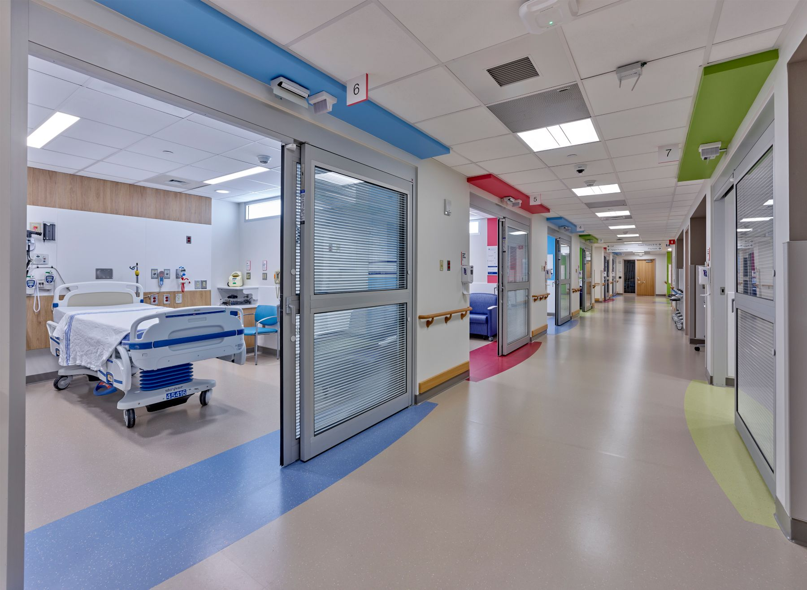

# Improving Observation Unit (OU) Operations at Montanaro Hospital

## Project Overview
This project focuses on enhancing the operational efficiency of Montanaro Hospital’s 23-bed Observation Unit (OU). The primary goal is to reduce patient transfers ("flipping") from observation to inpatient status through predictive analytics, data-driven insights, and operational optimization.

## Problem Statement
Frequent patient flipping leads to:
- Inefficient resource utilization.
- Increased length of stay (LOS).
- Emergency Department (ED) overcrowding.
- Reduced patient throughput.

**Key Metrics**:
- Current flipping rate: 45%.
- Weekly capacity: 44 patients.
- Bed utilization: 83%.
- LWBS (Left Without Being Seen) cases: 884 annually.

## Dataset Details
The dataset includes:
- **Demographics**: Age, gender.
- **Diagnoses**: Disease-related group (DRG) codes.
- **Vital Signs**: Pulse, temperature, blood pressure.
- **Insurance**: Primary insurance type.

### Data Preparation
- Missing values imputed (e.g., blood pressure differences calculated).
- Categorical variables encoded into dummy variables.
- Recording of "Flipped" status (Yes/No).

## Exploratory Data Analysis (EDA)
### Key Findings
1. **Age**:
   - Older patients (80-90 years) have the highest flipping rates.
2. **Diseases**:
   - Syncope and dehydration are strongly correlated with flipping.
3. **Gender**:
   - Females are less likely to flip compared to males.
4. **Insurance**:
   - Patients with Medicare and Medicaid are more likely to flip.

### Quantitative Highlights
- **Syncope**: 300+ cases, highest patient count.
- Patients with **temperature ≥99°F** and **pulse ≥103 bpm** are more likely to flip.

## Model Development
Three predictive models were developed to predict flipping:

1. **Logistic Regression**:
   - **Full Model**:
     - Accuracy: 65.36%.
     - Sensitivity: 70.75%.
     - Significant predictors: Medicare insurance, DRG codes.
   - **Reduced Model**:
     - Accuracy: 61.45%.
     - More interpretable with fewer predictors.

2. **Decision Tree**:
   - Accuracy: 64.8%.
   - Key variables: Insurance, temperature, pulse.

3. **Random Forest**:
   - Accuracy: 61.45%.
   - Out-of-Bag Error Rate: 38.85%.
   - Robust against overfitting.

### Selected Model
- **Logistic Regression** provides the best balance between interpretability and predictive performance.

## Operational Improvements
### Adjusting Flipping Cutoff Rates
- **Cutoff = 0.3**:
  - Flipping rate reduced to 22%.
  - Additional patients treated: 570 annually.
  - Bed utilization increased to 88%.
  - Revenue increase: $618,800/year ($11,900/month).

### Monte Carlo Simulation
- Simulated increased patient load (from 44 to 55 weekly).
- Ensured capacity without compromising care quality.

### Patient Flow Improvements
- Weekly patient capacity increased from 44 to 55.
- Annual capacity addition: 570 patients.
- LWBS cases reduced by 46%.

## Recommendations
### Short-Term
- Deploy predictive models for real-time prioritization of patients likely to flip.
- Optimize bed allocation based on model predictions.

### Long-Term
- Expand data collection to include additional variables (e.g., comorbidities, social determinants).
- Build dashboards for real-time insights.
- Develop exclusion lists to reduce unnecessary inpatient admissions.

### Quantitative Goals
- Flipping rate: ≤20%.
- Bed utilization: ≥88%.
- Revenue increase: $618,800 annually.

## Expected Outcomes
- **Operational Efficiency**:
  - Reduced LOS and ED overcrowding.
  - Improved patient throughput.

- **Financial Impact**:
  - Enhanced annual revenue by optimizing flipping and patient volume.

- **Scalability**:
  - Framework adaptable to other healthcare institutions.

This README provides a detailed roadmap for improving the Observation Unit’s operations at Montanaro Hospital using data-driven strategies and predictive analytics to deliver measurable outcomes.
